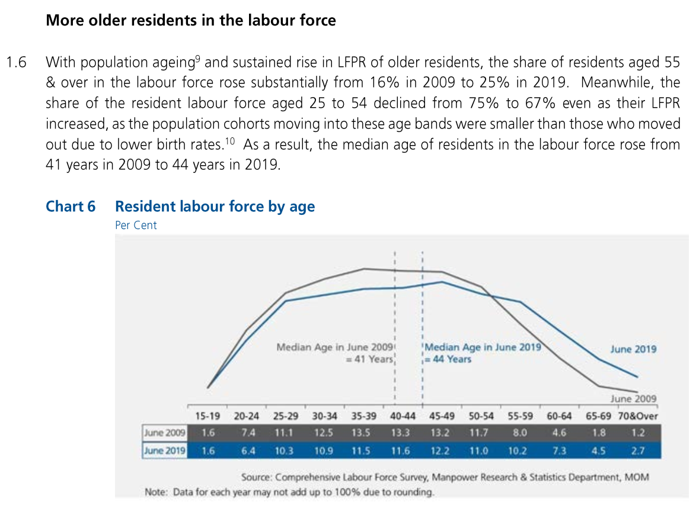

```{r setup, include=FALSE}
knitr::opts_chunk$set(echo = FALSE)
```

Population aging is a well-known phenomenon for many years in Singapore. But how does it affect the labor force market?

Recently, I gathered the Residents labor force data (from 2009 to 2019) from Singapore Ministry of Manpower website. In this post, I wanted to share some of the insights derived from my data visualization. In my data visualization, I compared the residents Labor Force Participation Rate in 2009 with that in 2019. Besides, I compared the Shares of different Age Groups in the labor market in 2009 and in 2019. The tool I used is Tableau.


# 1. Objective

Singapore Ministry of Manpower released the report [Labour Force in Singapore 2019](https://stats.mom.gov.sg/Pages/Labour-Force-In-Singapore-2019.aspx) on 30-Jan-2020. On the page #22, it threw a statement that **'More older residents in labor force'** and then illustrated it with the chart **'Residents Labor Force by Age'**. I attach the snapshot as below.


After check the [original data](https://stats.mom.gov.sg/Pages/Labour-Force-Tables2019.aspx) - Table 5, We feel that this illustration is misleading and cannot fully support the statement.

Therefore, I made some changes on the illustration to better support the statement.

# 2. Critics and Recommended Improvements

First of all, the original chart contains a few Clarify issues and Aesthetic issues.

### Clarity Issues
1.  Y-axis does not exist, then it is very tough to gauge the heights. In addition, these two lines do not have the dots/markers which can highlight the value.  
2.  The shares of Age-groups for June 2009 and June 2019 are stacked together with the Age-groups as the X-axis. It looks like a data table, which undermines the usage of the chart. Since the two solid-lines are used to indicate the percentage of the share of Age-groups, it is redundant to show the numbers again at the bottom.  
3.  The 'Per Cent' should not displayed as the subtitle of the chart. Instead, it should be displayed as the unit of the Y-axis. The subtitle is on the top left corner whereas the shares of Age-group are at the bottom (i.e., X-axis). So, it makes the users difficult to interpret the chart.  
4.  The two reference lines (Median Age) neither mean the Age-group (e.g., 40-44, 45-49 etc.) nor mean the share of the Age-groups (e.g., 13.3%, 12.2% etc.). They are just purely two numbers (41 and 44). So, they should not refer to the X-axis. It could be displayed as an annotation.  
5.  The title and subtitle are not helpful for users to understand the context.  
6.  The LFPR data is mentioned in the statement, but it is not shown in the chart.  
7.  The statement compares the shares of labor force Aged 25~54 with the one Aged 55 or over. But it is not clearly illustrated in the chart. 


