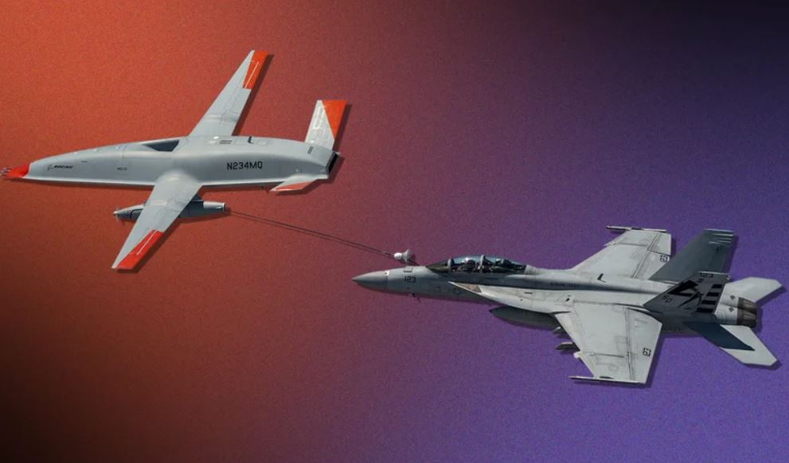

Starting from April 2022, I am going to publish the Tech Articles I read and I feel it is interesting and/or useful for everyone to read.

I will provide a short summary of each article and the link to the original article. Feel free to post it on your own website or send to your friends if you like it.

### 1.  My Path to Financial Independence as a Software Engineer
This gentleman earned financial independence at early 30s as a software engineer. The table below shows his career path and savings' growth path. He share the lessons he learnt in his early life and the experiences how he achieved the goal of financial independence. You can read the [full article here.]( https://software.rajivprab.com/2021/12/26/my-path-to-financial-independence-as-a-software-engineer)
  

| Year | Employer          | Annual Income | Amount Spent (excl taxes) | Net Worth | Notes                                                  |
|------|-------------------|---------------|---------------------------|-----------|--------------------------------------------------------|
| 2009 | Intel             | 100,000       | 38,000                    | 35,000    | New college grad with a Master's degree in Engineering |
| 2010 | Intel             | 100,000       | 38,000                    | 75,000    |                                                        |
| 2011 | Intel             | 105,000       | 38,000                    | 122,000   |                                                        |
| 2012 | Intel/Sun         | 115,000       | 38,000                    | 175,000   |                                                        |
| 2013 | Sun               | 125,000       | 39,000                    | 236,000   |                                                        |
| 2014 | Sun               | 125,000       | 39,000                    | 320,000   |                                                        |
| 2015 | Hedge Fund        | 230,000       | 56,000                    | 450,000   | Career pivot from Hardware -> Software                 |
| 2016 | Hedge Fund/Google | 230,000       | 56,000                    | 505,000   |                                                        |
| 2017 | Google            | 300,000       | 64,000                    | 850,000   |                                                        |
| 2018 | Google            | 330,000       | 68,000                    | 990,000   | Income boost due to increase in Google stock price     |
| 2019 | Amazon            | 475,000       | 94,000                    | 1,130,000 |                                                        |
| 2020 | Amazon            | 475,000       | 78,000                    | 1,470,000 |                                                        |
| 2021 | Amazon            | 625,000       | 78,000                    | 2,400,000 | Income boost due to increase in Amazon stock price     |

### 2.  The 100 greatest innovations of 2021
The winners span over a wide range of areas:  

* Health  
* Gadgets  
- Auto  
- Personal Care  
- Aerospace  
- Engineering  
- Entertainment  
- Home  
- Security  
- Sports and Outdoors  

I list two examples.

#### A drone that refuels fighter jets: Boeing MQ-25  

Boeing is bringing the future of unmanned aircraft carrier aviation to the U.S. Navy with the MQ-25.

#### AI that predicts the 3D structure of proteins  
AlphaFold, an AI system developed by DeepMind, is able to predict a protein's 3D structure.

The article is [here](https://www.popsci.com/technology/best-of-whats-new-2021/#Aerospace).

### 3.  FAA Investigating Controversial Crash Video  
The FAA has confirmed it's investigating the circumstances of a video purporting to show the November crash of a 1940 Taylorcraft posted by YouTuber Trevor Jacob. "The FAA is investigating this event," the agency said in a statement issued Monday. "The agency does not discuss open investigations."  The video prompted an explosive and generally harsh reaction from commenters on YouTube and on various forums. Many are calling for an investigation into the production of the video; a few are calling it fake. And plenty have analyzed it frame by frame to support their accusations about its authenticity.
The full article is [here](https://www.avweb.com/aviation-news/plane-crash-video-sparks-online-backlash).

### 4.  ASUS will release a 17-inch foldable OLED laptop this year
Asus is known for doing funky things, especially funky things with screens. So it was only a matter of time before the company tried its hand at one of these, and we're finally getting a look at the first generation. Say hello to the Zenbook 17 Fold OLED, a 17.3-inch laptop with a foldable OLED screen. For those seeking a more traditional offering, there's also a clamshell Zenbook 14 OLED coming later this year. Click it to view [the news](https://www.theverge.com/2022/1/5/22867624/asus-zenbook-17-fold-oled-foldable-laptop-tablet-specs-price-release-date).
