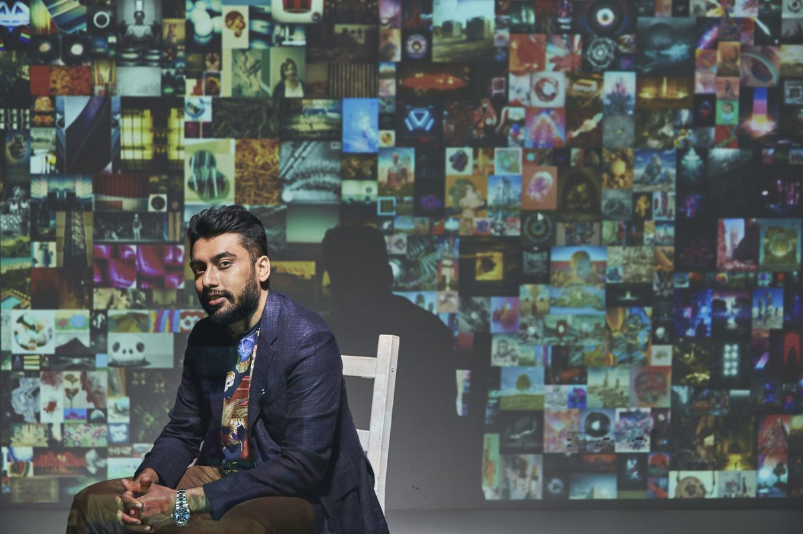

I will provide a short summary of each article and the link to the original article. Feel free to post it on your own website or send to your friends if you like it.

I will provide a short summary of each article and the link to the original article. Feel free to post it on your own website or send to your friends if you like it.

I will provide a short summary of each article and the link to the original article. Feel free to post it on your own website or send to your friends if you like it.

Starting from April 2022, I am going to publish the Tech Articles I read and I feel it is interesting and/or useful for everyone to read.

I will provide a short summary of each article and the link to the original article. Feel free to post it on your own website or send to your friends if you like it.

### 1.  The 20 Internet Giants That Rule the Web
From late 1990s to now, the list of Top 20 companies which dominate the internet has changed dramatically. It reflects the trends of the internet industry.  

The visualization below used the data primarily from ComScore's U.S. Multi-Platform Properties ranking.  You can read the [full article here.](https://www.visualcapitalist.com/visualizing-the-abundance-of-elements-in-the-earths-crust/)
  

### 2.  From Crypto to Christie's: How an Indian metaverse king made his fortune  

Vignesh Sundaresan, aka MetaKovan, has amassed a digital art collection worth tens of millions of dollars. At a sale by Christie's, he bid $69 million to win Beeple piece - "Everydays: The First 5000 Days."  

He told the Financial Times the $69 million acquisition was "much less" than 10% of his net worth, which he said was almost entirely in crypto. He represents a group of nouveau-riche people who accumulates the wealth from cryptocurrency investments.

[Here is the Full article.](https://www.reuters.com/investigates/special-report/finance-crypto-sundaresan/)

### 3.  NASA: Dream Chaser on a path to maiden flight as primary structure arrives at SNC  
The FAA has confirmed it's investigating the circumstances of a video purporting to show the November crash of a 1940. The full article is [here](https://www.nasaspaceflight.com/2019/10/dream-chaser-path-flight-primary-structure-snc/).

### 4.  AMAZON office in Seattle: The spheres
In January 2018, Amazon officially launch their hybrid greenhouse office "The Spheres: The plants, the architecture, and a transforming city".  

Click it to view [the news](https://seattle.curbed.com/2018/1/30/16947838/amazon-spheres-seattle-architecture-photos).

### 5.  Five mysteries the Standard Model can't explain  

- __1. Why do neutrinos have mass?__
- __2. What is dark matter?__
- __3. Why is there so much matter in the universe?__
- __4. Why is the expansion of the universe accelerating?__
- __5. Is there a particle associated with the force of gravity?__

Asus is known for doing funky things, especially funky things with screens. So it was only a matter. Click it to view [the news](https://www.symmetrymagazine.org/article/five-mysteries-the-standard-model-cant-explain).