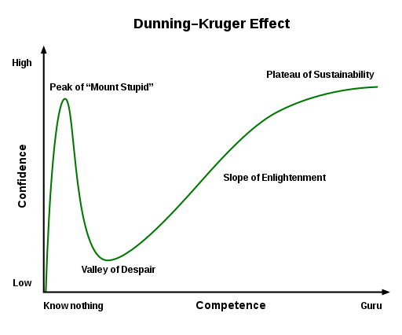
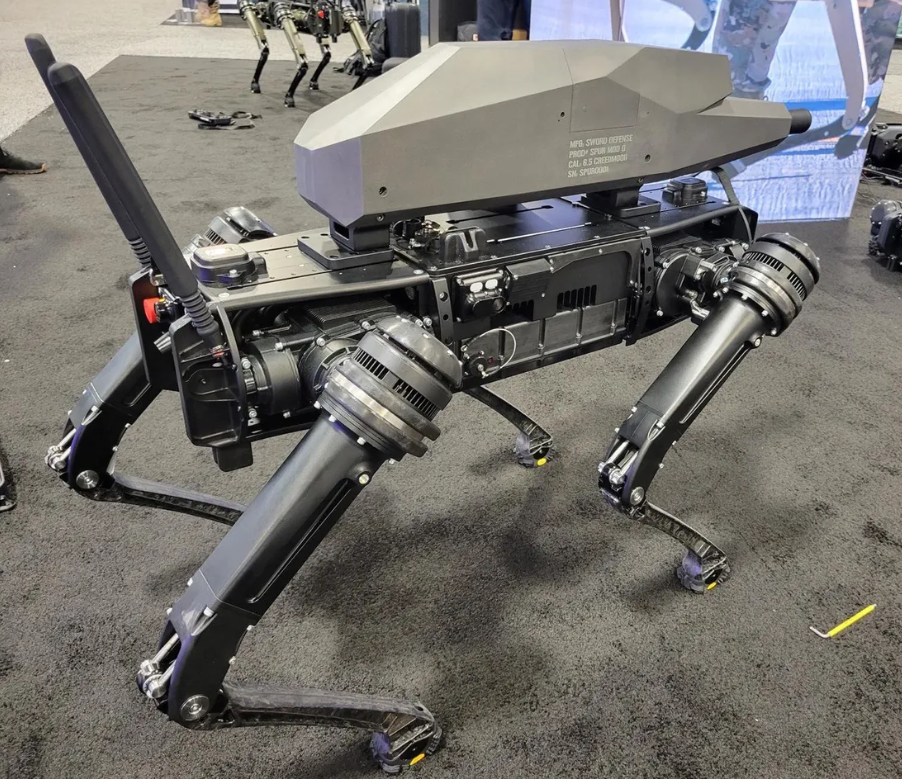

This week, I am going to share two books which are useful for Data Analysis. Both are available for free online. The first book \<Python for Data Analysis\> is for Python users whereas the second book \<R in Action\> is for R users.

Then, I would like to share an artile which talks about combating Impostor Syndrome from a senior software engineer in New York Times. 

### 1.  \<Python for Data Analysis\>, *3rd Edition*, by Wes McKinney  

The book is very intuitive and informative for the beginners who want to learn the foundation of Python in Data Analysis field. It is concerned abut the nuts and bolts of manipulating, processing, cleaning, and crunching data in Python.  

This book starts with the Python languages basics and built-in Data Structures and Functions. Then, it elaborates the **Numpy** package for numerical *array* data computing, **Pandas** package for tabular or heterogeneous data with *Series* and *DataFrame* formats. Also, it explains the chart plotting package **Matplotlib** for data visualization purpose in details.

The 3rd Edition HTML online version can be accessed from [here](https://wesmckinney.com/book/) for free. All the code examples in the book are published on GitHub and available for download. However, the paper and e-book versions are yet to be published. Hence, if you go to Amazon website, it still shows 2nd Edition book.  

### 2.  \<R in Action\>, *3rd Edition*, Manning Publications   

Besides Python, another language which is widely used in Data Analysis field is R. Initially, it was adopted mainly by Statisticians.  Over the years, due to the development of R libraries and RStudio tool, more and more non-Statisticians start to embrace it. It can be used for statistics, predictive analytics, and data visualization.  

This book \<\<R in Action\>\> is good for both novices and experienced R mavens. It teaches you how to use R language to: 

- Access data (importing data from multiple sources)
- Clean data (code missing data, fix or delete miscoded data, transform variables into more useful formats)
- Explore and summarize data (getting descriptive statistics to help characterize the data)
- Visualize data (using a wide range of attractive and meaningful graphs)
- Model data (uncovering relationships, testing hypotheses, and developing predictive models using both basic and advancedl statistical techniques and cutting edge machine learning approaches)
- Prepare results for others (creating publication-quality tables, graphs, and reports)

The online HTML version can be accessed for free [here](https://livebook.manning.com/book/r-in-action-third-edition/welcome/v-12/).

### 3.  Embracing Impostor Syndrome  

Occasionally, everyone of us may experience the Impostor Syndrome. (If you have no idea what it is, you can check it out [here](https://www.freecodecamp.org/news/what-is-imposter-syndrome-and-how-do-you-overcome-it/). In short, it means a feeling of being a fraud or not being good enough to get the job done. It's common among software engineers, developers and designers working in tech companies, especially those not coming from a traditional tech background.

It is very common among people who are new to their role and lack the experience of some of their co-workers.

This author of the article ["Embracing Impostor Syndrom"](https://www.justindfuller.com/2022/02/embracing-impostor-syndrome/), __Mr. Justin Fuller__, who is a Senior Software Engineer at **The New York Times**, had the same issue often time in the past. Rather than overcoming it, he embraced it. As he said, "To embrace Imposter Syndrome, I would accept that I am not, and perhaps will never be, fully competent at what I do. I would acknowledge that the depth of my knowledge is doomed to be superficial, at least for quite a long time." He focuses on recognizing the areas of knowledge that he uses and understanding where he lacks depth. By doing so, it reduces the surprise when his knowledge fails him. 

### 4.  They're putting guns on robot dogs now  

Quadrupedal robots are one of the most interesting developments in robotics in recent years. They're small, nimble, and able to traverse environments that frustrate wheeled machines. So, of course, it was only a matter of time until someone put a gun on one.

The images below show a quadrupedal robot - a Vision 60 unit built by US firm Ghost Robotics - that's been equipped with a custom gun by small-arms specialists Sword International. It seems the gun itself (dubbed the SPUR or "special purpose unmanned rifle") is designed to be fitted onto a variety of robotic platforms. It has a 30x optical zoom, thermal camera for targeting in the dark, and an effective range of 1,200 meters.

Here is [the news](https://www.theverge.com/2021/10/14/22726111/robot-dogs-with-guns-sword-international-ghost-robotics).  

  

The robot in outside:  

