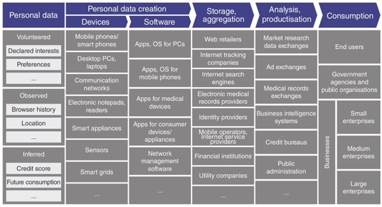

Recently, I was intrigued by a topic "Data Assets". As we all know, nowadays Data has become a new asset in the real-world and Data privacy is the top concern when it comes to the usage and commercialization. I read a few articles and felt that it is necessary to state the current status and what measures we can take on to overcome the facing challenges in the industry.

In short, I want to share the conclusion first: We need A balanced Personal Data Ecosystem!

## Introduction 

In January 2011, World Economic Forum together with Bain & Company published an article "Personal Data: The Emergence of a New Asset Class" to explain the Personal Data Asset and why and how we should safeguard the individual's privacy while making use of the personal data.[1][2]

Through the recent years, both business organizations and government agencies have reaped tremendous benefits from the use of personal data to serve the general public. Nevertheless, we can be sure that data will still have a lot of potential for us to explore. The usage of data and our reliance on it will continue to grow at unprecedented levels.

Having said that, we must realize that there are plenty of issues associated with Data Asset. In this report, I would like to discuss about the Data Asset and how we should govern Data Asset properly with a balanced Data Ecosystem.

## What is Data? 

According to Wikipedia, by definition Data are individual facts, statistics, or items of information, often numeric; in a more technical sense, data are a set of values of qualitative or quantitative variables about one or more person or objects.[3] Then, the Personal Data is the digital data created by and about people (or person). 

It could be volunteered data such as Facebook profiles and Instagram photos etc.; it could be the observed data such as location data or online purchase transaction data etc.; it could also be the inferred data such as the customer's credit score or customer's preferences on cuisine etc. Based on International Data Company (IDC)'s forecast, the global data volume will reach 100ZB milestone in 2023 and then 175ZB in 2025. (1 ZB equals to 1024 EB, 1 EB equals to 1024 PB, 1 PB equals to 1024 TB, 1 TB equals to 1024 GB. Hence, 1 ZB is equivalent to 10e12 GB.)

## What are the roles of the relevant parties? \

We can clearly categorize the relevant parties into three groups of stakeholders as below. 
	- Individuals: a person who is natural person, or a legal person or a digital persona who are the sources and subjects of personal data.
	- Private Sector: for-profit businesses or companies or private organizations which involved in the capture, storage, analysis and sharing of personal data for the purposes of developing and/or monetizing related services and applications.
	- Public Sector: governments and non-profit public organizations that involved in the passing of legislation and policies that regulate the capture and use of personal data within their respective jurisdictions.

## What is Personal Data Ecosystem? 

Below chart shows the Personal Data Ecosystem from end to end, created by Bain & Company with World Economic Forum.[1]

As we mentioned above, there are three major stakeholders which consists of thousands of millions of users, businesses, and government agencies. They have made personal data into an asset class from its creation to its consumption. An entire ecosystem feeds on this asset by productizing it to such an extent that it can be consumed by so many others whether it's personalized Ads or personalized newsletters. It's a bit like our personal data are the lumps of carbon in the ground and an entire industry has spawned to mine, ship, cut, and sell them as diamonds. 
 
_Source: Bain and Company, World Economic Forum report_

In the Data Asset value-chain ecosystem above, there are five key elements.

- 	Personal data: as we explained earlier. 
\
- 	Creation: via the data source channels (the devices and software), the personal data can be identified and collected through manual or automated processes. 
\
- 	Storage: throughout the entire life cycle stages, data must be stored in a way that's both secure and accessible. The exact medium used for storage is Cloud-based storage, on-premises servers, and other storage media (like USB drive and CB-ROMs). 
\
-	Analysis: after the data has been inspected and transformed into a readily usable state, it can be analyzed. Depending on the specific goals, the data analysis can be diagnostic, descriptive, predictive, or prescriptive. It could include various tools and methodologies such as Data Visualizations and Machine Learning techniques. 
\
-	Consumption: the involving parties can consume the data and leverage the analytical outcomes to achieve their objectives. For instance, the government can identify the criminals or terrorists; the banks can detect the fraudulent transactions.

## What is the status-quo of Data Ecosystem? Imbalanced! 

In our current Personal Data Ecosystem, the imbalance phenomenon has become more and more severe. The private sector stakeholders control massive amounts of data because of which they are holding unprecedented power. Therefore, it may lead to Digital Supremacy can cause many problems in the ecosystem. 

As we all know, the personal data is concentrated within some e-commerce and social media enterprises, indicating a more and more obvious integration effect. It is inevitable that there will be a lot of problems arising such as data discrimination, data leakage, information cocoon, and privacy infringement. For small or medium sized enterprises, since they do not possess too much personal data, they cannot develop and compete with existing giants due to the monopolization of data. For individual's perspective, they feel that they are unable to defend the personal rights because of the difficulties derived from the decentralized data asset distribution and management. For the government agencies and regulators, it will be very difficult for them to maintain the fairness of market resource allocation and the stability of the market economy. 

As the leading Internet giants are solidifying its market position, a small number of large companies can have the capacity to collect and analyze data through numerous apps or portals to understand user preferences and habits. In such cases, they can subtly instill their thoughts and objectives to consumers by leveraging their advantages. Realistically speaking, in the current digital age, there is almost no way for people to completely stop the connection from the services provided by these giant companies. However, public users have no knowledge of the process of big data operations. 

Hence, people are restricted to the "information cocoon" and are driven to make decisions which could highly be possible from the targeted marketing or advertising channels. Other SMEs are also unable to compete with these giant companies, which surely will lead to monopolization by a few companies. If more and more data are concentrated among a small number of giant companies, the entire society could face the issues such as personal privacy and even national security. 

In a nutshell, the Personal Data Ecosystem is hugely imbalanced, and the situation is worsening. We need to act to make it balanced. 

## How to build a balanced Data Ecosystem?

According to PwC Data Asset Ecosystem White Paper published in November 2020, to establish a balanced ecosystem, we should implement proper policies, measures, and systems from four perspectives:[4] 

###	from a policy and legal perspective:

the government and regulators should speed up legislation and clarify the mechanism for data rights confirmation and pricing recommendation. 

Since Data is now an asset, it is crucial to confirm the rights such as ownership, right to use, right to operate, right to know, right to be forgotten, right to rectification, right to erase, right to object, and right to restrict processing, etc. 

Any assets have its value. The following three methods can be used for data pricing. All of them have taken the Risk, Quality, Application and Cost into considerations; and they are currently publicly recognized. Each method has its pros and cons and cane be selected based on the specific business scenarios. 
	
*	Cost Method: Valuation = replacement cost * depreciation coefficient * expected return coefficient
*	Income Method: Valuation = sum of the excess business income
*	Market Method: Valuation = comparable data asset turnover * correction coefficient

###	from an economic perspective:

It is necessary to form a new business model focusing on data assets. A well-balanced data ecosystem can help us maximize the economic value of data. The commercialization process will gradually sink to the individuals to form a series of models including data transaction, data bank, data trust, and data intermediary that connects Government, Businesses and Consumers.

-	Data Platform Transaction Model: \
it explicitly prices a specific data set and trades with related suppliers. This is a platform that bridges data supply and demand and is supported by third-party professional technologies and government supervision, to eventually realize the transaction and flow of data. This model has resolved the main issues in terms of mutual trust of data, data protection, and data supply and demand.

-	Data Bank Model: \
basically, the personal data assets can be managed and operated like the banking model, which can achieve centralization and effective management, and in the meantime can realize the added value and smooth flow of personal data, bringing certain benefits to individuals. Under this model, the personal data bank focuses on the protection of the users' ownership, right to know, privacy and income rights to their personal data, and establishes a comprehensive service system for the management and operation of personal big data assets.

-	Data Trust Model: \
 we can deem the Data Asset as a trust property. As other traditional trust property, we can isolate the ownership of the Data Asset and the beneficiary of the Data Asset. Separating the rights and functions such as the ownership, right to use, and right to benefits adequately matches the composite arrangement of trust property rights and ownership. As a result, it can meet the commercial and business requirements.

-	Data Intermediary Model: \
to avoid the excessive concentration of power in a few giant companies, we need some medium-sized peripheral organizations to act as "Mediator of Individual Data" (MID). They strive for the greatest interests of data creators and obtains reasonable commission based on the benefits obtained. In this model, we can achieve data dignity and produce the balanced power.

### 	from a societal perspective:
we should avoid data discrimination and achieve data inclusion. Essentially, data discrimination means the differences in the data value, and it comes from the differences in the personal attributes. We shall remove it by implementing the establishment of digital archives in all industries (including healthcare and education) to ensure the release of personal data value and to promote the equal rights for the entire population. Data inclusion means that we shall integrate the personal data with enterprise data and government data properly to improve the service efficiency and create more social value.

###	from a technological perspective:
it is needed to establish a technical ecosystem of the data assets. Given the uniqueness of data assets, data sharing must be secure, and the data computing must be performed in trusted execution environment. To attain the goal of secure data sharing, we may adopt the combination of "on-chain" and "off-chain" blockchain storage. To ensure the secure and trusted data computing, the current standard is TPM2.0 (Trusted Platform Module) which was defined by Trusted Computing Group (TCG).

# Conclusion

Since year 2011 when people gradually realize the Data is a new asset,[2] numerous issues arise and many of them are still pending us to resolve. Personal data assets have great impact in various part of our society like national security, market allocation, enterprise operations and individual rights. 

It is critical to make sure the Personal Data Ecosystem is a balanced system. However, in recent years, we have observed that the status-quo is far from the balance. The giant companies have overwhelming dominance in this area, and they can exert their concentrated power over the competition and may pose tremendous threat to the society or the individuals. Therefore, in order to promote a sustainable digital economy, improve the social governance and protect the personal privacy and rights, we can take actions from the following areas to build a balanced personal data ecosystem.

-	Clarify and improve the ownership rights system of the data asset through policies and regulations
-	Establish appropriate business models of data assets via enterprise innovations
-	Implement data anti-discrimination and data inclusion
-	Establish the management and application system for data assets compliant with technical standards

[1] World Economic Forum: \
https://www3.weforum.org/docs/WEF_ITTC_PersonalDataNewAsset_Report_2011.pdf; 

[2] The Economists: \
https://www.economist.com/leaders/2017/05/06/the-worlds-most-valuable-resource-is-no-longer-oil-but-data; 

[3] Wikipedia: \
https://en.wikipedia.org/wiki/Data; 

[4] PwC: \
https://www.pwccn.com/en/consulting/white-paper-on-data-asset-ecology-nov2020.pdf.
