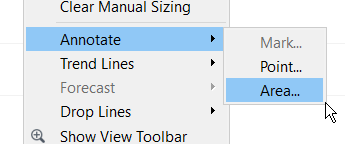
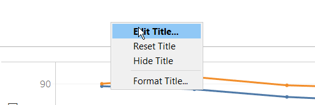

```{r setup, include=FALSE}
knitr::opts_chunk$set(echo = FALSE)
```

Population aging is a well-known phenomenon for many years in Singapore. But how does it affect the labor force market?

Recently, I gathered the Residents labor force data (from 2009 to 2019) from Singapore Ministry of Manpower website. In this post, I wanted to share some of the insights derived from my data visualization. In my data visualization, I compared the residents Labor Force Participation Rate in 2009 with that in 2019. Besides, I compared the Shares of different Age Groups in the labor market in 2009 and in 2019. The tool I used is Tableau.


# 1. Objective

Singapore Ministry of Manpower released the report [Labour Force in Singapore 2019](https://stats.mom.gov.sg/Pages/Labour-Force-In-Singapore-2019.aspx) on 30-Jan-2020. On the page #22, it threw a statement that **'More older residents in labor force'** and then illustrated it with the chart **'Residents Labor Force by Age'**. I attach the snapshot as below.


After check the [original data](https://stats.mom.gov.sg/Pages/Labour-Force-Tables2019.aspx) - Table 5, We feel that this illustration is misleading and cannot fully support the statement.

Therefore, I made some changes on the illustration to better support the statement.

# 2. Critics and Recommended Improvements

First of all, the original chart contains a few Clarify issues and Aesthetic issues.

### Clarity Issues
1.  Y-axis does not exist, then it is very tough to gauge the heights. In addition, these two lines do not have the dots/markers which can highlight the value.  
2.  The shares of Age-groups for June 2009 and June 2019 are stacked together with the Age-groups as the X-axis. It looks like a data table, which undermines the usage of the chart. Since the two solid-lines are used to indicate the percentage of the share of Age-groups, it is redundant to show the numbers again at the bottom.  
3.  The 'Per Cent' should not displayed as the subtitle of the chart. Instead, it should be displayed as the unit of the Y-axis. The subtitle is on the top left corner whereas the shares of Age-group are at the bottom (i.e., X-axis). So, it makes the users difficult to interpret the chart.  
4.  The two reference lines (Median Age) neither mean the Age-group (e.g., 40-44, 45-49 etc.) nor mean the share of the Age-groups (e.g., 13.3%, 12.2% etc.). They are just purely two numbers (41 and 44). So, they should not refer to the X-axis. It could be displayed as an annotation.  
5.  The title and subtitle are not helpful for users to understand the context.  
6.  The LFPR data is mentioned in the statement, but it is not shown in the chart.  
7.  The statement compares the shares of labor force Aged 25~54 with the one Aged 55 or over. But it is not clearly illustrated in the chart. 

### Aesthetic Issues  
1.  Colors of June 2009 and June 2019 do not contrast strongly with each other. They use the Dark Blue and Dark Grey.  
2.  All the text in the chart (except the Source and Note) use the same fonts.  
3.  Grid line is missing on the chart.  
4.  These two solid-lines (not the reference lines) do not have the dots/markers.  

> <span style="color:blue">**Based on the issues, we proposed some improvements to handle these issues.** </span>

### Improvements for the Clarity Issues and their merits
1.	Add Y-axis, axis title and unit; -> so it can be easier to gauge the heights.
2.	Remove the stacked data (June 2009 and June 2019) from the bottom X-axis; -> so it can make the chart looks clear and neat.
3.	Remove the 'Per Cent' subtitle. Instead, set it as the unit of Y-axis; -> so the end-users can interpret the unit of data.
4.	Remove the two Reference line. Instead, add them as annotation; -> it is to remove misleading reference line.
5.	Change the title and subtitle to meaningful ones which reflect the context and objectives. -> so the end-users can interpret the whole chart easily.


### Improvements for the Aethetic Issues and their merits
1.	Change the colors of 2009-June and 2019-June to make them contrast strongly; -> so the comparison would be more obvious.
2.	Change the fonts, use different fonts for axis title, Legend, Title and Annotation etc.; -> then the key messages can be highlighted.
3.	Add the grid lines for Y-axis; -> so the end-users can interpret the chart easily.

# 3. Sketch the design

As the report mentioned the Residents Local Force Participation Rate, we can add it into the chart as well.  

- The upper part of the chart is the Participation Rate of Ages in 2009-June versus in 2019-June. 

- The lower part of the chart is the Shares of Ages in 2009-June versus in 2019-June.  


# 4. Data Preparation
Since we wanted to add the Participation Rate in the chart, we need to download the original data and put it together with the Shares of Ages in one [data table](./LFPRandSharesByAges.xlsx).  
_Note: LFPR stands for Labor Force Participation Rate._

| Ages      	| LFPR 2009-June 	| LFPR 2019-June 	| Shares 2009-June 	| Shares 2019-June 	|
|-----------	|----------------	|----------------	|------------------	|------------------	|
| 15~19     	|           11.8 	|           15.1 	|              1.6 	|              1.6 	|
| 20~24     	|           63.5 	|           61.0 	|              7.4 	|              6.4 	|
| 25~29     	|           89.3 	|           90.1 	|             11.1 	|             10.3 	|
| 30~34     	|           88.3 	|           92.3 	|             12.5 	|             10.9 	|
| 35~39     	|           85.8 	|           89.6 	|             13.5 	|             11.5 	|
| 40~44     	|           84.4 	|           88.7 	|             13.3 	|             11.6 	|
| 45~49     	|           82.1 	|           87.9 	|             13.3 	|             12.2 	|
| 50~54     	|           78.1 	|           82.3 	|             11.7 	|             11.0 	|
| 55~59     	|           68.4 	|           75.0 	|              8.0 	|             10.2 	|
| 60~64     	|           50.6 	|           63.9 	|              4.6 	|              7.3 	|
| 65~79     	|           29.9 	|           46.1 	|              1.8 	|              4.5 	|
| 70 & Over 	|           10.5 	|           17.6 	|              1.2 	|              2.7 	|

# 5. Snapshot of my Final Data Visualization in Tableau
You can go to my [Tableau Public](https://public.tableau.com/profile/hngling#!/vizhome/Makeover1_LH/Sheet1) to view High Resolution version.


# 6. Implementation Guide in Tableau (Step by Step)

1.    Load the excel file into Tableau
2.    Drag the Ages into Columns, Drag the LFPR 2009-June to the Rows, Drag the LFPR 2019-June on the right side of the chart.

3.    Change it to Line and choose 'All' Markers in the Color window.

4.    Drag the Shares 2009-June to Rows and Drag Shares 2019-June to the right side of 2nd chart.

5.    Right click any in the Measure Names pane. Edit all the Alias. Then rename them as easily understandable ones.  


6.    Right click any in the Measure Names pane. Click Edit Colors. Then select the contrast colors for 2009 and 2019.  


7.    Change the Share 2009-June and Share 2019-June to Area.


8.    Synchronize the Axis for both the upper part of the chart (i.e, Participation Rate) and the lower part of the chart(i.e. Shares).  


9.    Select the Axis on the left side and update the Axis titles. Remove the Right sides Axis titles.  


10.   Right click anywhere on the chart to add a few Annotations.

11.   Right click the title to edit the title. I rename it as 'Singapore Residents Labor Force Participation Rate and Shares by Ages'. 


# 7. Major Observations from final Data Visualization

During the implementation progress, we can find out three major observations.

- **For the Ages 15~24**, in terms of Participation Rate and Shares in Total Labor Force, there are **no big differences between 2009-June and 2019-June**.
- **In 2009-June the majority** of Labor Force came from **ages 25~54** whereas **in 2019-June the majority** came from **ages 25~59**. It implies that people tend to stay longer years in their career. Perhaps more and more employers like to keep the older workers in the workplace, but further investigations are required to prove it.
- In general, almost all ages have **higher participation rate in 2019-June than in 2009-June**.


