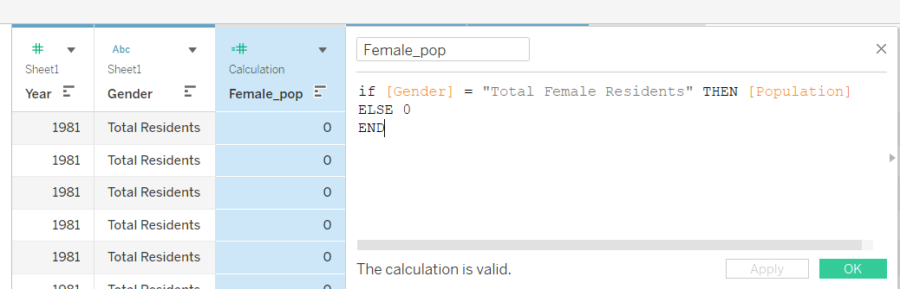
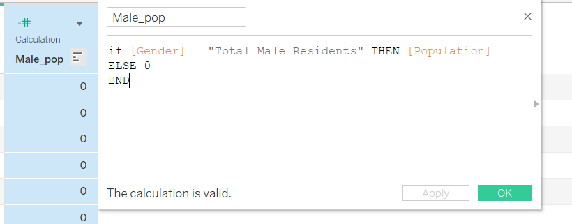
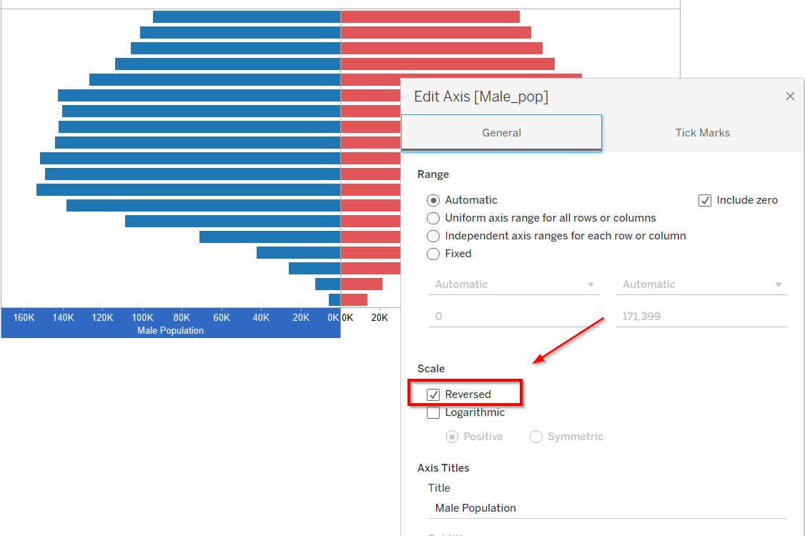
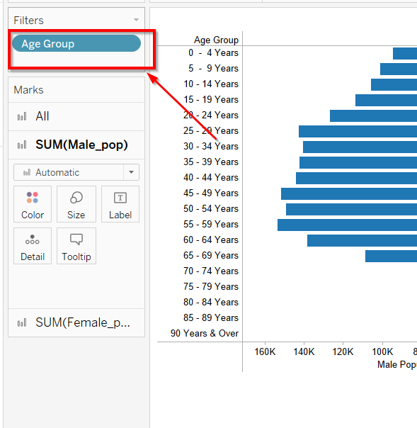
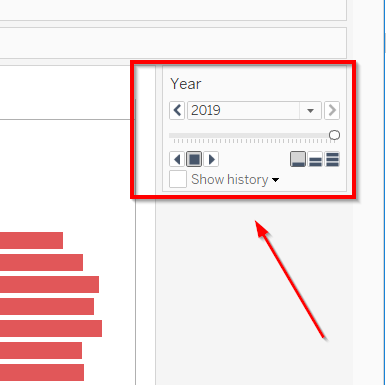
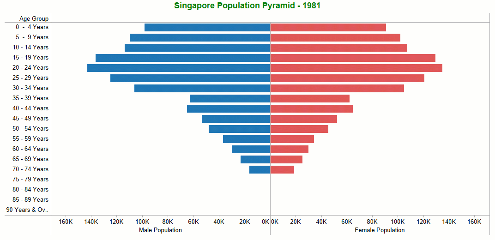

**Pyramid Chart** has the form of a triangle with lines dividing it into sections. A population pyramid is a graph that shows the distribution of ages across a population divided down the center between male and female members of the population. 

In this post, I used the Singapore Population data from [data.gov.sg](https://data.gov.sg/dataset/resident-population-by-ethnicity-gender-and-age-group?resource_id=f9dbfc75-a2dc-42af-9f50-425e4107ae84). I truncated the data before 1981 and kept the data from Year 1981 to Year 2019.  

I created the charts in the Tableau Desktop and then published them on my Tableau Public website.

# 1. Step 1

I removed the data (before Year 1981) and saved it as a new file in my laptop. Then, I rename the column as below: Year, Gender, Age Group and Population.

# 2. Step 2

I created two calculated fields: Female Population and Male Population.  

# 3. Step 3  

In the Tableau sheet, add the **Male Population** and **Female Population** as the columns and the *Age Group* as Rows.

Choose blue color for Male Population and red color for Female Population.

Reverse the Male Population Axis as below.

# 4. Step 4  

In the Filters pane, filter out the unwanted "Age Groups".

# 5. Step 5  

Add the **Year** into Pages pane. After that, the "Year" will show up as a Card on the upper right side.

We can use a powerful tool within Tableau: Animation, by running the pages from 1981 to 2019.

# 3. Final DataViz  

Here is the final data visualization.

<iframe src="https://public.tableau.com/views/Pop_Pyramid/SingaporePopulationPyramid?:language=en-US&:display_count=n&:origin=viz_share_link&:showVizHome=no&:embed=true"
 width="700" height="1000"></iframe>
 
 
The link to [this chart in my Tableau Public](https://public.tableau.com/views/Pop_Pyramid/SingaporePopulationPyramid?:language=en-US&:display_count=n&:origin=viz_share_link).

