```{r setup, include=FALSE}
knitr::opts_chunk$set(echo = FALSE)
```

Armed conflicts consists in the use of armed force between two or more organized armed groups, governmental or non-governmental, by definition from International Committee of the Red Cross. 

In South East Asia context, the Armed Conflicts have been ongoing for a long time. In 1950s, internal conflicts took place in Myanmar. In 1960s, insurgency happened in South Thailand. You can find the full list on wikipedia. In this paper, we did visual analytics on the recent Armed Conflicts in South East Asia from 2015 to 2020 and explored some spatial-temporal patterns from it.

# 1. Objective

Armed Conflict Location & Event Data Project [(ACLED)](https://acleddata.com) collected all the raw dataset about the Armed Conflicts globally. Prof. Kam made a spatial-temporal data visualization [here](https://public.tableau.com/profile/tskam#!/vizhome/South-eastAsiaArmedConflictAnalysis/South-eastAsiaArmedConflictAnalysis).


After checking the [raw dataset](Southeast-Asia_2010-2020_Oct31.xlsx), I think we can have a better way to visualize the data so the users would be able to interpret the Armed Conflicts situation in South East Asia easily.

In this paper, firstly I criticized the original data visualization with some suggestions, then it followed up with implementation in Tableau tool. At the end of the paper, a few important insights were derived from my data visualization.


# 2. Critics and Recommended Improvements

In 2012, Ben Jones published an article about the key principles of Data Visualization. In short, we should visualize the data clearly and aesthetically. To support that, he created a [Cartesian coordinate system](https://dataremixed.com/2012/05/data-visualization-clarity-or-aesthetics/) as shown below. 


According to coordinate system, I observed some clarity and aesthetic issues. 


### Clarity Issues
| S/N 	| Clarity  	| Recommendations	and Advantages |
|-----	|----------------------------------------------------------------------------------------------------------	|------------------------------------------------------------------------------------------------------------	|
| 1   	| On the spatial map, 6 different event types are represented by 6 different colors in circle shape. All the circles are scattered across the map and they mix with each other. It looks a bit messy and makes the users difficult to identify each event type and compare one with another.	| We should abandon the circle shape. I suggest to use the Pie chart to illustrate the Event Types at the country level. It will allow the users to interpret the data easier. |
| 2   	| The line chart tries to show 6 different event types. But the sequence of the event types does not match the sequence in the legend. It is confusing the users. Besides, Fatalities data is found in the raw dataset but it is not plotted in the line chart. | We need to re-plot the line chart for the Event Types and put all event types in one chart with different colors. Fatalities data is quite informational for the users to understand how severe the Armed Conflicts situation is, so we should plot the Fatalities data. |
| 3   	| The X-axis title "Event Date" is not correct because the line chart shows the data aggregated at the Year level rather than Day level. Besides, the Year 2020 data only includes the data from 2020/01/01 to 2020/10/31, but this point is not highlighted. In the meantime, the different Event Types have different scales of Y-axis and it causes misconceptions. For instance, Battles' scale is '400~700' whereas Riots' scale is '5~20'.  | We should remove the X-axis title "Event Date". Then, we need to highlight that the data for Year 2020 is cut off at Oct-31, 2020. We need to put all the types in one chart and then use different colors to differentiate them and also synchronize the scale for all types. 	|


### Aesthetic Issues  

| S/N 	| Aesthetic  	| Recommendations	and Advantages |
|-----	|-------------------------------------------------------------------------------------------------------	|------------------------------------------------------------------------------------------------------------	|
| 4   	| The explanation of the numbers are displayed as well as the sheet name.	The explanation has repeated 6 times and some of the wordings are cut off.| We should remove the explanation of the numbers and the sheet name. Rather, we can add the meaning or explanation of the numbers into the title. |
| 5   	| The year '2020' in the X-axis and legend names are cut off.  Perhaps the font size is a bit large.  | Change the font size so that the wordings will not be cut off.	|
| 6   	| The Spatial chart and line chart are displayed side by side horizontally, as a result of  which the space looks too crowded. | Maybe we can re-position the line chart from the right side to the bottom. It will make the entire visualization look tidy and neat. |

On top of the Clarity and Aesthetic issues, we can also find out some Interactivity issues.

### Interactivity Issues  

| S/N 	| Interactivity  	| Recommendations	and Advantages |
|-----	|-------------------------------------------------------------------------------------------------------	|------------------------------------------------------------------------------------------------------------	|
| 7   	| The dataset consists of multiple years data but the original data visualization missed out the filter 'Year'. So, the users cannot interactively to filter the data by specific Year or Year-range.| We should add the Year filter so the users will be able to clearly compare the changes year over year.	|
| 8   	| The dataset comprises 6 event types but the original data visualization missed out the filter 'Event Types'. So, the users cannot interactively to filter the data by event types.  | We should add the Event Type filter so the users can deep dive into each event type and analyze the pattern of each event type.	|


> <span style="color:blue">**To fix the issues above, we proposed a new design.** </span>

# 3. Sketch my proposed design

As explained above, we will plot both the Events and Fatalities data. We will choose line charts for them, and they will be positioned below the Map. 

Then, we will have three filters: Year, Event Type and COuntry.

The sketch is shown as below.

<br>


# 4. Data Preparation

The quality of the raw dataset looks good enough for us to start the data visualization. So, we do not need to massage it. Below table is the metadata for the raw dataset.


| Column   Name 	| Content 	|
|-	|-	|
| ISO  	| A   numeric code for each individual country 	|
| EVENT_ID_CNTY  	| An   individual identifier by number and country acronym (updated annually) 	|
| EVENT_ID_NO_CNTY  	| An   individual numeric identifier (updated annually) 	|
| EVENT_DATE  	| The   day, month and year on which an event took place 	|
| YEAR  	| The   year in which an event took place 	|
| TIME_PRECISION  	| A   numeric code indicating the level of certainty of the date coded for the event 	|
| EVENT_TYPE  	| The   type of event 	|
| SUB_EVENT_TYPE  	| The   type of sub-event 	|
| ACTOR1  	| The   named actor involved in the event 	|
| ASSOC_ACTOR_1  	| The   named actor associated with or identifying ACTOR1 	|
| INTER1  	| A   numeric code indicating the type of ACTOR1 	|
| ACTOR2  	| The   named actor involved in the event 	|
| ASSOC_ACTOR_2  	| The   named actor associated with or identifying ACTOR2 	|
| INTER2  	| A   numeric code indicating the type of ACTOR2 	|
| INTERACTION  	| A   numeric code indicating the interaction between types of ACTOR1 and ACTOR2 	|
| REGION  	| The   region of the world where the event took place 	|
| COUNTRY  	| The   country in which the event took place 	|
| ADMIN1  	| The   largest sub-national administrative region in which the event took place 	|
| ADMIN2  	| The   second largest sub-national administrative region in which the event took place 	|
| ADMIN3  	| The   third largest sub-national administrative region in which the event took place 	|
| LOCATION  	| The   location in which the event took place 	|
| LATITUDE  	| The   latitude of the location 	|
| LONGITUDE  	| The   longitude of the location 	|
| GEO_PRECISION  	| A   numeric code indicating the level of certainty of the location coded for the event 	|
| SOURCE  	| The   source of the event report 	|
| SOURCE SCALE  	| The   scale (local, regional, national, international) of the source 	|
| NOTES  	| A   short description of the event 	|
| FATALITIES  	| The   number of reported fatalities which occurred during the event 	|


However, I would like to point out a few things to take note. Our objective is to evaluate the events data and fatalities data at the country level such as Malaysia, Thailand and Indonesia etc. Therefore, many unnecessary columns in the raw dataset will be ignored.

1.    The **ADMIN1**, **ADMIN2** and **ADMIN3** etc. columns are lower level administrative regions. We do not need them in this visualization.

2.    The **Sub-Event Types** are sub-level of **Event Types**. Since there are too many sub Event Types, let us just focus on the Event types.

3.    The **Latitude** and **Longitude** are for the specific region/city rather than the country itself. We cannot use it as our intention is to plot at country level.

4.    The **Event Date** column will not be used since we already have the **Year** column. In this visualization, we are only concerned at Year level.

# 5. Step by step implementation in Tableau

1.    Load the Southeast-Asia_2010-2020_Oct31.xlsx file into Tableau.
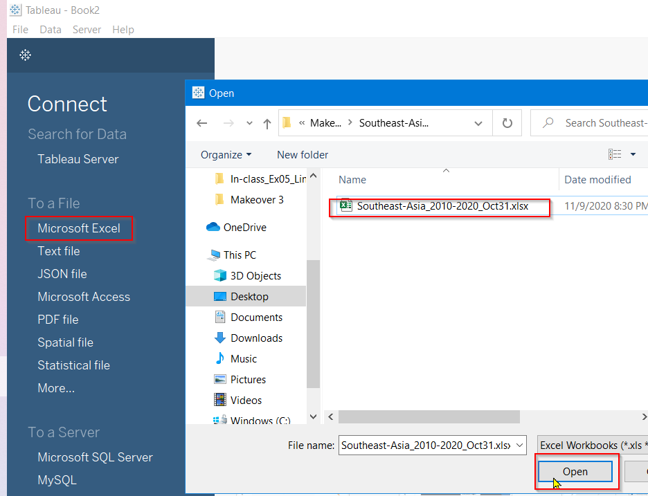

2.    For these unwanted columns, right click its drop-down arrow and then and click *'Hide'* button to hide it.  <br>


After hide all those unwanted columns, the cleaned data would like as below. <br>


###   Create a worksheet to show the Choropleth map with Fatalities and Events data

-   3.    Create the first worksheet: name it *Map*. Then, drag the 'Country' to Rows and the 'Fatalities' to Columns. <br>
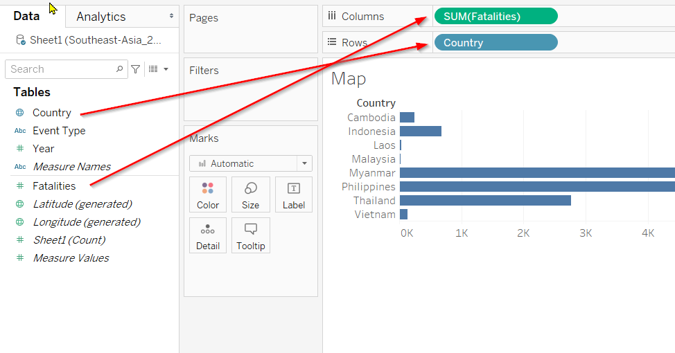

-   4.    Then, click the *Show Me* on the top right corner and then choose the Worldmap format. The Latitude and Longitude for the Country would be automatically generated. As shown in below.  <br>

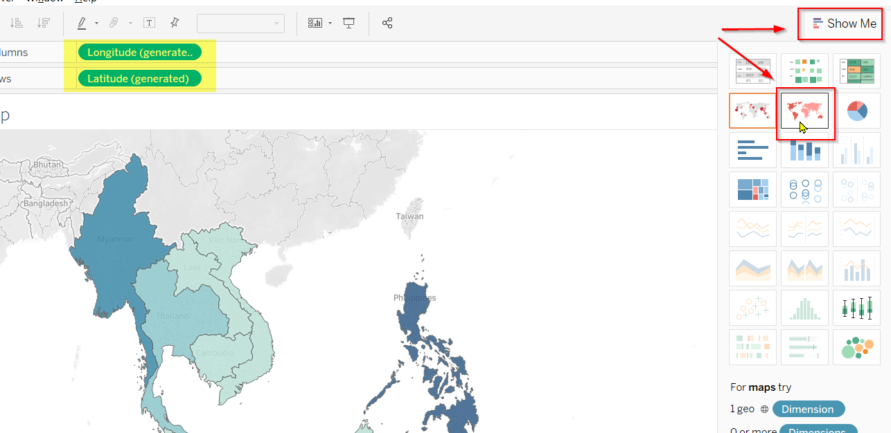

-   5.    To change the Sum(Fatalities)'s color. Click the Edit Colors option from the drop-down arrow.
 <br>
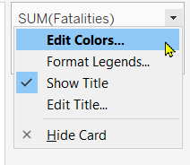 <br>


-   6.   Set the Data range Start at 0 and End at 13,000.  <br>
 <br>


-   7.    Go to the Tables pane. Right click 'Country' field and click 'Add to New Layer'.
 <br>
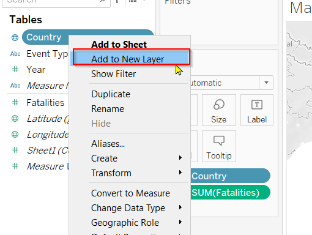

-   8.    Now we have two layers Marks. On the Country(2) mark, drag the 'Event Type' from Table pane to Color option.
 <br>
 

-   9.    Also, drag the 'Event Type' to the Size option.
 <br>


-   10.   Right click the Event Type size option, select the Count under the Measure as the size.
 <br>
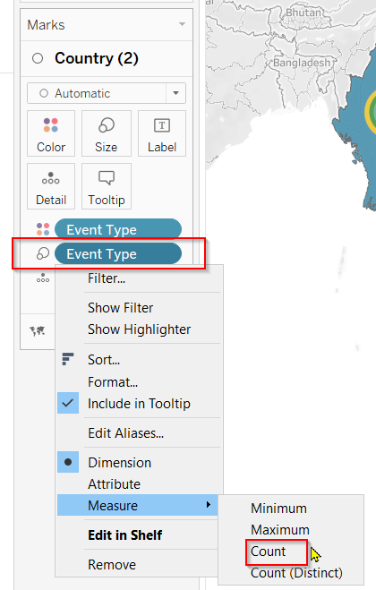

-   11.   Select the Pie shape from drop-down menu.
 <br>


-   12.   Let's increase the size a bit.
 <br>
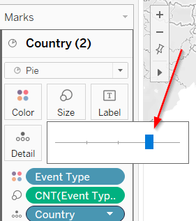

-   13.   To add the filters, drag the Country, Event Type and Year from Tables pane to Filters pane.
 <br>


-   14. Since we focus on Year 2015 to 2020, let's set the range of Year filter from 2015 to 2020 by right clicking the Year filter drop-down arrow and then clicking Edit Filter.
 <br>


-   15.   Right click the Year filter drop-down arrow and then select Show Filter.
 <br>


-   16.   Under the Year filter card, rigth click the drop-down arrow and then click 'Edit Title'.
 <br>
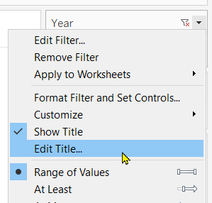

-   17.   Change the title to 'Select the Year for Map'.
 <br>


So, the final Map worksheet looks like as below.
 <br>


### Create a worksheet to show Events data

-   18.   Create a new worksheet and name it 'Events'. Drag the Event Type to Rows field and the Year to Columns field.
 <br>


-   19.   Under the Rows field, right click the drop-down arrow of Event Type and then select the Count from Measure menu.
 <br>
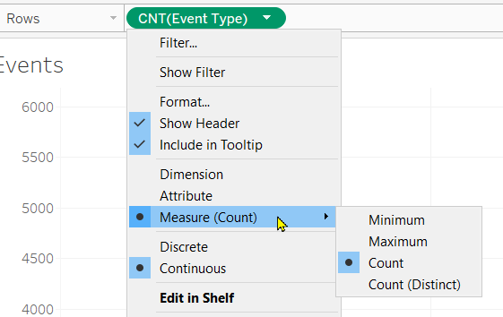

-   20.   Drag the Country from Tables pane to the Color option in Marks pane.
 <br>


-   21.   To add the filters, add Country, Event Type and Year from Tables pane to Filters pane.
 <br>


-   22.   Right click the drop-down arrow of Country filter and select Show Filter.
 <br>


-   23.   Right click the drop-down arrow of Event Type filter and select Show Filter.
 <br>


-   24.   For the Event Type filter card, select the 'All Using This Data Source' from the 'Apply to Worksheets' menu.
 <br>


-   25.   For the Country filter card, select the 'All Using This Data Source' from the 'Apply to Worksheets' menu.
 <br>


-   26.   Right click the drop-down arrow of CNT(Event Type) card and select 'Hide Card'.
 <br>
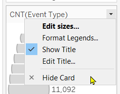


-   27.   Right click the Y-axis and click 'Edit Axis'. Then, change the Axis Title to 'Count of Events'.
 <br>


-   28.   Right click the X-axis and click 'Edit Axis'. Then change the range of the Year: Fixed Start = 2015 and Fixed End = 2020.
 <br>


-   29.   Double click the worksheet title to Edit Title. Configure the title as below.
 <br>


The final Events worksheet looks as below.
 <br>

### Create the worksheet to show Fatalities data

-   30.   Create a new worksheet and name it 'Fatalities'. Drag the Fatalities to Rows field and the Year to Columns field. Tableau automatically use the SUM measure for Fatalities.
 <br>


-   31.   Drag the Country from Tables pane to the Color option in Marks pane.
 <br>


-   32.   Right click the Y-axis and click 'Edit Axis'. Then, change the Axis Title to 'Count of Fatalities'.
 <br>


-   33.   Right click the X-axis and click 'Edit Axis'. Then change the range of the Year: Fixed Start = 2015 and Fixed End = 2020.
 <br>


-   34.   Double click the worksheet title to Edit Title. Configure the title as below.
 <br>
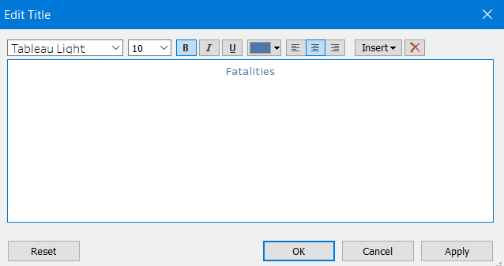


The final Fatalities worksheet looks as below.
 <br>
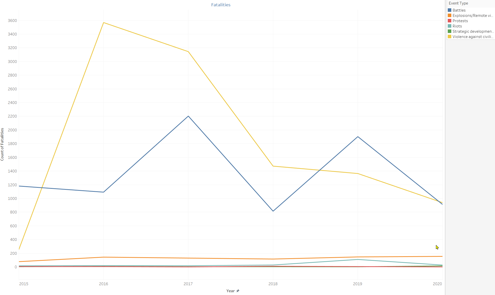

### Create final dashboard

-   35.   We just created three worksheets: Map, Events and Fatalities. Now, let's start to create a dashboard. Name the dashboard to 'Armed Conflicts'. By using the Horizontal and Vertical objects, we can drag the three worksheets to the dashboard as shown below. Then, customize the dashboard size 1400x900. Tick the 'Show dashboard title'.
 <br>
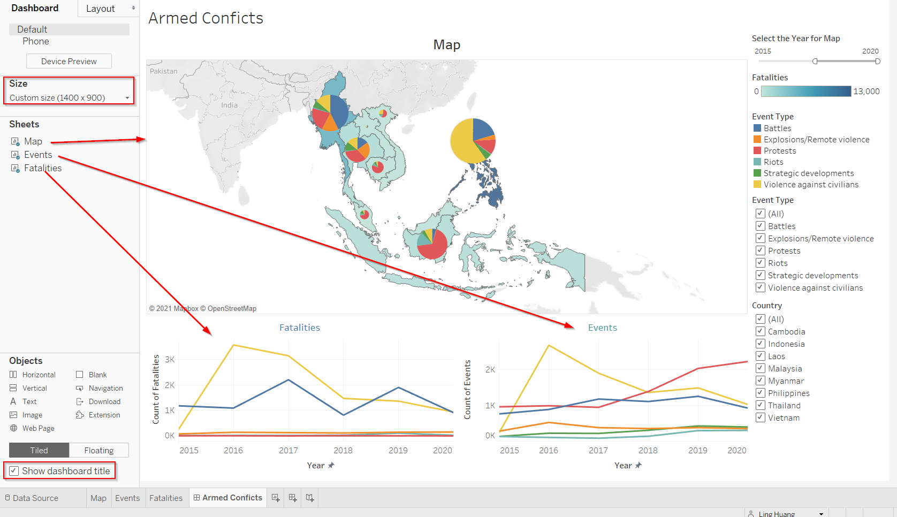

-   36.   Let's spice up the dashboard a little bit. Double click the Map title and edit the title as below.
 <br>


-   37.   Double click the dashboard title and edit title as below.
 <br>


-   38.   Drag a Text object to the bottom of the dashboard.
 <br>


-   39.   Double click the Text object and edit the text as below.
 <br>


# 6. Final Data Visualization in Tableau 
Here is the final interactive data visualization in Tableau. You can visit my [Tableau Public Profile](https://public.tableau.com/profile/hngling#!/vizhome/ArmedConflicts_16163190682600/ArmedConficts) to play around.

<br>
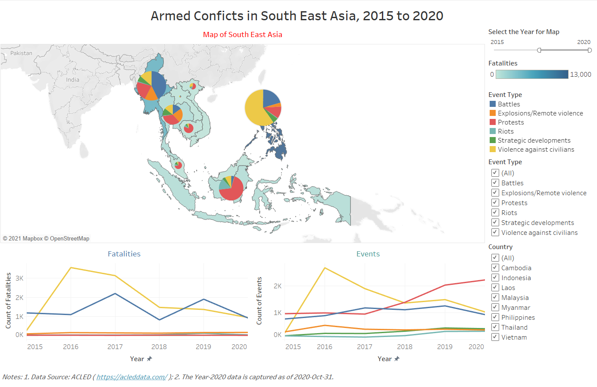


# 7. Major Observations from my Data Viz

#### Observation 1
- By comparing the size of the Pie, it is obvious that **Philippines** has the most events than other countries in the period 2015 to 2020. Following are **Myanmar** and then **Indonesia**. However, the majority of the events in **Philippines** is the Even Type **Violence against civilians**(_Yellow color_) whereas in  **Myanmar** it is **Battles**(_Blue color_) and in **Indonesia** it is **Protests**(_Red color_).
<br>

BTW. Narrow down the Year range to 1 year, and slide the filter from left to right to observe the changes Year over Year. We will find the same pattern!!!
<br>


#### Observation 2
- **Philippines** has the most fatalities which is 12,905, followed by **Myanmar**. It makes sense given that **Philippines** has the highest count of event occurrences and **Myanmar** has the second highest.
<br>
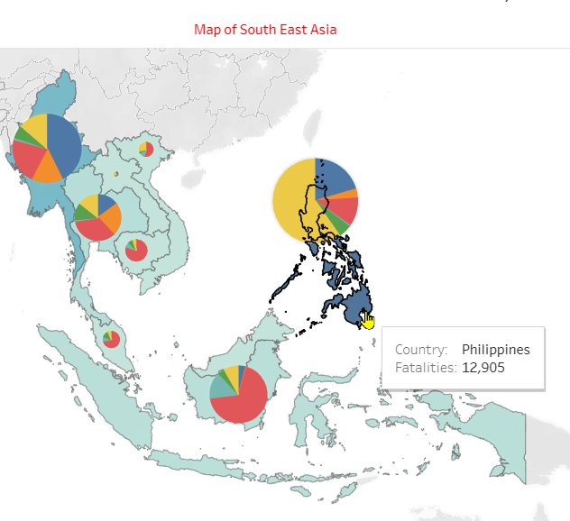


#### Observation 3
- In general, **Violence against civilians** causes the more fatalities than other events. As a result of it, the dead cases suddenly increased dramatically from ~250 in year 2015 to ~3500 in year 2016. Then, it dropped gradually to ~1000 cases in 2020.
<br>


#### Observation 4
- In total, **Violence against civilians** event occurs the most from 2015 to 2020. The occurrence frequency peaked at ~2500 and then decreased more than 50% to ~1000 in 2020.
<br>


#### Observation 5
- The frequency of **Protests** event stayed flat at ~1000 from 2015 to 2017. In 2017, it started to take off and grew tremendously to over ~2000 in the year 2020.
<br>


