```{r setup, include=FALSE}
knitr::opts_chunk$set(echo = FALSE)
```

As of today, Covid-19 pandemic is still ongoing and we have experienced a few recurring waves worldwide. When it comes to vaccination willingness, we have seen differing attitudes and reasons.

Based on the survey data is collected by [Imperial College London YouGov Covid 19 Behaviour Tracker Data Hub](https://github.com/YouGov-Data/covid-19-tracker) and hosted at Github,  I created this post which is meant to visualize the survey results of willingness of getting COVID19 Vaccination in various countries.

<br>


# 1. Objective

A research team from Imperial College London is currently conducting a survey to understand the willingness of the public on Covid-19 vaccination. Based on the collected results, they came up with the chart below to show the public's opinion. 


After examine the chart and check the [collected data](https://github.com/YouGov-Data/covid-19-tracker), I would like to propose a new chart to better show the public's attitude to the Covid-19 vaccination.


# 2. Critics and Recommended Improvements

In terms of the clarity and aesthetics, the original charts have a lot of room for improvement. I marked some on the chart as below and summarized them in the below tables. 


### Clarity Issues
| S/N 	| Clarity                                                                                                                                                                                                                                                                                                                               	| Recommendations                                                                                            	|
|-----	|---------------------------------------------------------------------------------------------------------------------------------------------------------------------------------------------------------------------------------------------------------------------------------------------------------------------------------------	|------------------------------------------------------------------------------------------------------------	|
| 1   	| The survey was conducted by sampling the population in each country.  So, uncertainties surely exist in the survey results.  But the chart failed to present the confidence interval to indicate the uncertainties.  The charts failed to hit the objective  (i.e., show what countries favor the vaccine and what countries do not). 	| We need to add the Confidence Intervals  into the chart.                                                   	|
| 2   	| The 'stacked bar chart' on the left is to show the percentages of each answer. It is difficult for the users to interpret the percentages.                                                                                                                                                                                             	| Replace the stacked bar chart with Gantt Chart.  In addition, display the average score of  the responses. 	|
| 3   	| The 'bar chart' on the right, in fact, is part of the left chart.  It just extracted the '1 - Strongly agree' part and sorted in descending order.  It looks a bit redundant.                                                                                                                                                          	| The 'sorting' could be realized in one chart, in the left chart directly.                                  	|
| 4   	| The legend 'Vac 1' on the far right is not interpretable at all. The original question is 'If a Covid-19 vaccine were made available to me this week,  I would definitely get it'                                                                                                                                          	| Show the exact original question(s) in the chart.                                                          	|


### Aesthetic Issues  

| S/N 	| Aesthetic                                                                                                                                                                                                      	| Recommendations                                   	|
|-----	|----------------------------------------------------------------------------------------------------------------------------------------------------------------------------------------------------------------	|---------------------------------------------------	|
| 5   	| Country name is not capitalized.                                                                                                                                                                              	| Capitalize the country name.                      	|
| 6   	| The X-axis in two charts are not standardized.  The X-axis on the left has no decimals whereas  the X-axis on the right has decimal. They represent the same thing and the decimal  does not add any values. 	| Remove the decimal in the right  chart.           	|
| 7   	| Bad fonts. And there is a spelling error 'vacinne' which should be 'vaccine'.                                                                                                                                  	| Choose a better font and fix the  spelling error. 	|

> <span style="color:blue">**To fix the issues above, we proposed a new design.** </span>

# 3. Sketch my proposed design

As mentioned earlier, I wanted to choose the Gantt chart. In the original dataset, there are too many questions. In our data viz, let's focus on these questions below.

| Title 	| Question                                                                                                    	|
|--------	|-------------------------------------------------------------------------------------------------------------	|
| vac2_1 	| I am worried about   getting COVID19                                                                        	|
| vac2_2 	| I am worried about   potential side effects of a COVID19 vaccine                                            	|
| vac2_3 	| I believe government   health authorities in my country will provide me with an effective COVID19   vaccine 	|
| vac2_6 	| If I do not get a   COVID19 vaccine when it is available, I will regret it                                  	|
| vac_3  	| If a Covid-19 vaccine   becomes available to me a year from now, I definitely intend to get it              	|


The responses are rated as below.

| Rating 	| Meaning           	|
|--------	|-------------------	|
| 1      	| Strongly agree    	|
| 2      	| Agree             	|
| 3      	| Neutral           	|
| 4      	| Disagree          	|
| 5      	| Strongly disagree 	|


Besides, some on-demand parameters such as **Gender, Age, Household Size, Household Children and Employment Status** etc. are added so that the users are able to break down the results based on his/her interests.

***Note: The sketch below is created with UX design tool  [Axure RP 9](https://www.axure.com/).*** <br />
(*PS: as a Product Manager, often times I use it to sketch my ideas before I handover to engineers and UI designers.*)<br />
<br />
_If you are interested, you can download my sketch file [here](axuresketch.rp)._


| S/N 	| Advantages 	|
|-----	|----------------------------------------------------------------------------------------	|
| 1   	| Use the Gantt chart and Confidence Intervals to display the uncertainty of the survey results.         	|
| 2   	| Build the on-demand filters for the users to view the data of their interest in an interactive way.       	|
| 3   	| Display the exact original questions for the users to interpret the data.       	|
| 4   	| Beautify the charts with better fonts and colors.       	|
<br />

# 4. Data Preparation

The original datasets are not suitable for us to use directly in Tableau. We need to massage them a bit to fit for our purpose.  

FYI. Since we only consider these 14 countries, let's keep their files only: australia.csv, canada.csv, denmark.csv, finland.csv, france.csv, germany.csv, italy.csv, japan.csv, netherlands.csv, norway.csv, singapore.csv, south-korea.csv, sweden.csv, united-kingdom.csv.  

1.    As shown below, the original datasets contain too much information. We are only concerned with **Gender, Age, Household_size, Household_children, Employment_status, vac2_1, vac2_2, vac2_3, vac2_6** and **vac_3** etc., so let's remove the unnecessary columns.

| RecordNo 	| endtime        	| qweek  	| gender 	| region         	| ... 	|
|----------	|----------------	|--------	|--------	|----------------	|-----	|
| 0        	| 2/4/2020 15:18 	| week 1 	| Female 	| Rio de Janeiro 	| ... 	|
| 1        	| 2/4/2020 15:20 	| week 1 	| Female 	| Sao Paulo      	| ... 	|
| 2        	| 2/4/2020 15:22 	| week 1 	| Female 	| Goias          	| ... 	|
| 3        	| 2/4/2020 15:23 	| week 1 	| Male   	| Rio de Janeiro 	| ... 	|
| 4        	| 2/4/2020 15:25 	| week 1 	| Female 	| Rio de Janeiro 	| ... 	|
| 5        	| 2/4/2020 15:38 	| week 1 	| Male   	| Minas Gerais   	| ... 	|
| ...      	| ...            	| ...    	| ...    	| ...            	| ... 	|

2.    In the Denmark, Finland, Norway and Sweden datasets, their ***employment status*** is spread to seven columns. 

| employment_status_1 	| employment_status_2 	| employment_status_3 	| employment_status_4 	| ... 	|
|---------------------	|---------------------	|---------------------	|---------------------	|-----	|
| No                  	| No                  	| Yes                 	| No                  	| ... 	|
| Yes                 	| No                  	| No                  	| No                  	| ... 	|
| No                  	| No                  	| No                  	| Yes                 	| ... 	|
| No                  	| No                  	| No                  	| No                  	| ... 	|
| ...                  	| ...                  	| ...                  	| ...                  	| ... 	|

Let's replace the value ***'Yes'*** with the actual value like ***'Full time employment', 'Not working', 'Part time employment' and 'Full time student'*** etc., and  merge them into one column **'employment_status'** like other datasets.  

Some entries have multiple responses on this question, (e.g. the survey respondents chose 'Yes' for employment_status_1 and employment_status_2 at the same time. To avoid misunderstanding, we removed these entries.

3.    Let's add one column **'Country'** in each dataset, and capitalize the column names for gender, age, household_size, household_children and employment_status. The final clean dataset looks like the table below.

| Country   	| Gender 	| Age 	| Household_size 	| Household_children 	| Employment_status    	| vac2_1 	| vac2_2 	| vac2_3 	| vac2_6 	| vac_3 	|
|-----------	|--------	|-----	|----------------	|--------------------	|----------------------	|--------	|--------	|--------	|--------	|-------	|
| Australia 	| Female 	| 66  	| 1              	| 0                  	| Retired              	| 5      	| 3      	| 3      	| 1      	| 1     	|
| Australia 	| Male   	| 62  	| 1              	| 0                  	| Part time employment 	| 4      	| 4      	| 2      	| 3      	| 2     	|
| Australia 	| Female 	| 34  	| 1              	| 0                  	| Part time employment 	| 3      	| 2      	| 1      	| 1      	| 1     	|
| Australia 	| Male   	| 43  	| 1              	| 0                  	| Full time employment 	| 4      	| 4      	| 3      	| 3      	| 4     	|
| Australia 	| Female 	| 38  	| 1              	| 0                  	| Part time employment 	| 5      	| 2      	| 5      	| 5      	| 1     	|
| ...       	| ...    	| ... 	| ...            	| ...                	| ...                  	| ...    	| ...    	| ...    	| ...    	| ...   	|


4.    Save each country's dataset as .csv file. Keep them in one folder.

_I uploaded the [final datasets](data.zip) here for your download._


# 5. Step by step implementation in Tableau

### Step 1
Load the australia.csv file into Tableau. As you may have seen, all .csv files appear in the 'Files' pane on the left side.


### Step 2
Click the dropdown arrow of australia.csv data, and click *'Remove'* button.


### Step 3
Now,  we need merge all files into one. So, to create a new union datatable: <br>
-   1. click the New Union button in the 'Files' pane; <br>
-   2. then select all data files in the 'Files' pane; <br>
-   3. then drag them into the New Union pop-up window; <br>
-   4. click *'OK'* button. <br>


### Step 4
New union data show up as below.


### Step 5
We need to make some changes on the data.

- change the  data type of **Household_children** to *'Number(whole)'*. 


- Rename the title of columns **vac2_1, vac2_2, vac2_3, vac2_6** and **vac_3** with the exact survey questions.
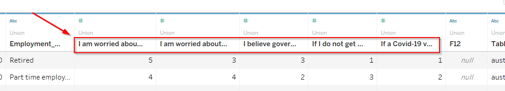

- Hide the last two columns **F12** and **Table Name**
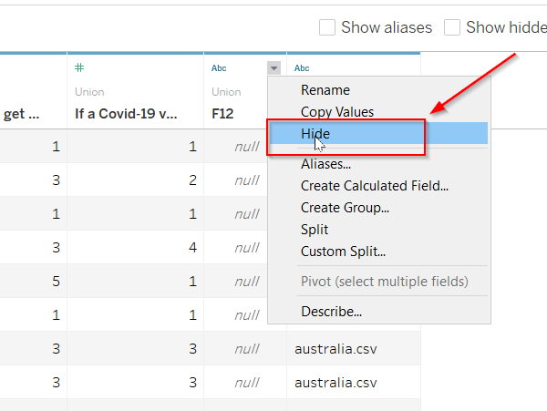

- Select the columns of Survey questions. Right click, then select *'Pivot'* to transform the data.


- Newly pivot data appears like the table below.


- Rename the title of the columns as bellow.
  - Pivot Field Names  -> Survey Question
  - Pivot Field Values -> Rating Score
  - Household_size     -> Household Size
  - Household_children -> Household Children
  - Employment_status  -> Employment Status


### Step 6
After update the column titles, now we can start to build the worksheet. Click the worksheet tab.

- Rename worksheet to *'COVID19-Survey'*.   


- Right click the **'Household Children'** and convert it to dimension.


- Right click the **'Household Size'** and convert it to dimension.


- Now, the **'Household Children'** and **'Household Size'** move up.


### Step 7
Now, we need to create parameter(s) and calculated field(s)/

- Right click the white space on the bottom left side. Select *'Create Parameter...'*.


- Name is **'Confidence Intervals'**. And add three values into the list. <br>


- Go to *'Analysis'* menu and click *'Create Calculated Field....'* .


- we need to create some fields to generate Lower Bar, Upper Bar and Bar Length for 90%, 95% and 99% Confidence Interval (CI) respectively. Formula are shown as below.
  - **Lower_Bar 90%  ** (Z-value for 90% CI is 1.645)
  
  - **Upper_Bar 90%  **
  

  - **Bar_length 90%  ** <br>
  
  - **Lower_Bar 95%  ** (Z-value for 95% CI is 1.96)
  
  - **Upper_Bar 95%  **
  
  - **Bar_length 95%  ** <br>
  
  - **Lower_Bar 99%  ** (Z-value for 99% CI is 2.576)
  
  - **Upper_Bar 99%  **
  
  - **Bar_length 99%** <br>
  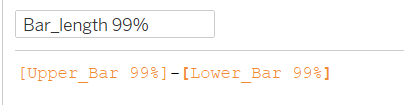
  - **Lower_Bar  **
  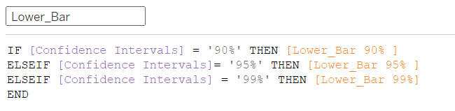
  - **Bar_length** <br>
  

### Step 8
After create the parameter and calculated fields, let's start to plot the chart. <br>

- Drag the **Country** to Rows, and the **Rating Score** and **Lower_Bar** to Columns. 

  
- Change the measure of **Rating Score** from *Sum* to *Average*.


- Go to **AVG(Rating Score)** pane. Change its shape to *Circle*. <br>


- Go to **AGG(Lower_Bar)** pane. Change its shape to *Gantt Bar*. <br>
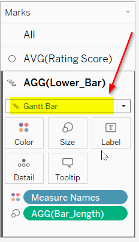

- Go to x-axis of **Lower_Bar**. Right click and select *Dual Axis*. <br>


- Right click the x-axis. Click *Synchronize Axis*. <br>


- Drag the **Bar_length** and drop on the *Size* option under **AGG(Lower_Bar)** pane. <br>


- Adjust the size of **AGG(Lower_Bar)** and try to make it thinner. <br>


- Click Color of **AVG(Rating Score)** and click *Edit Color...* <br>


- Pick two contrasting colors for them:**Avg. Rating Score** and **Lower_Bar**.


- Click the sort icon of x-axis to make it sort by descending order. Then, Right click the x-axis, and select *Edit Axis...*


- Change the **General** setting as below. Name the x-axis to **'Rating Score'**


- Change the **Tick Marks** settings as below.


- Go to top header **Lower_Bar**. Right Click and untick *Show Header*. Let's hide the top header.


### Step 9
Now, we need to show the filters to make the chart as interactive.<br>

-   Add the the dimensions into the Filters pane.  <br>
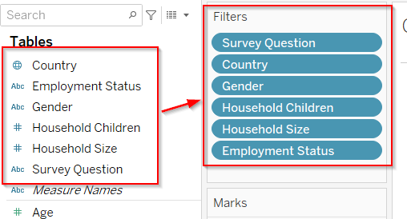
-   Add the the **Age** into the Filters pane.  <br>

-   Click the arrow of each filter and tick *Show Filter*. <br> 

-   For each filter, select their displayed pattern as below. <br>


<br>


### Step 10
Now, we need to show the **Confidence Intervals** parameter. 

-   click its arrow button, and tick *'Show Parameter'*. <br>
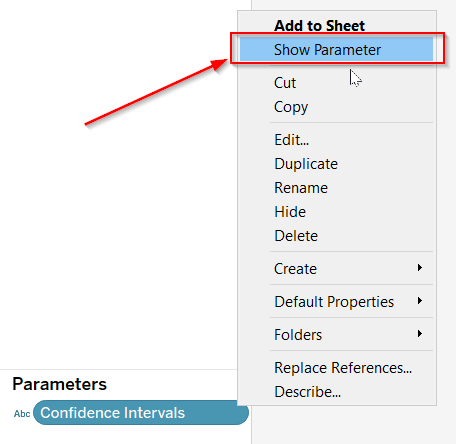

-   Then, select its displayed pattern.<br>


-   Let's hide the Measure Names card.<br>


### Step 11
Now, we need to do some adjustments on the format of the chart.<br>

-   Right click the x-axis and then click the *Format...*.<br>


-   Format it as below.<br>
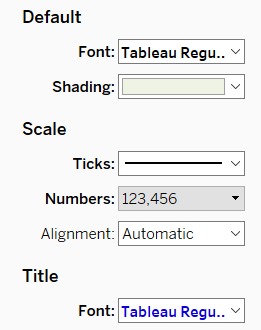

-   Right click the y-axis and  and then click the *Format...*.<br>


-   Format it as below.<br>
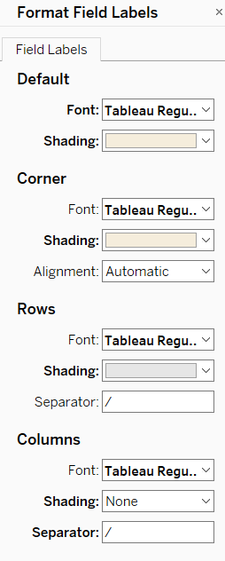

-   Right click the header and  and then click the *Format...*.<br>


-   Format it as below.<br>


-   Edit the title as below.<br>


-   Format the title as below.<br>
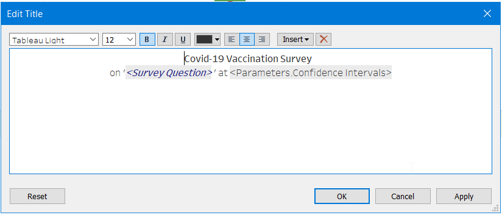

-   Add the annotation.<br>


-   Format the annotation as below.<br>

-   Add the annimations.<br>

-   Configure the annimations.<br>


### Step 12
Now, we need to create the dashboard.<br>

-   Rename the dashboard to **Covid-19 Vaccine Survey**, tick the option *'Show dashboard title'* and then add the worksheet COVID19_Survey into the dashboard.<br>


-   Adjust the layout of the dashboard. Move these filters and the parameter to the top. Re-align them as the screen below display.

<br>

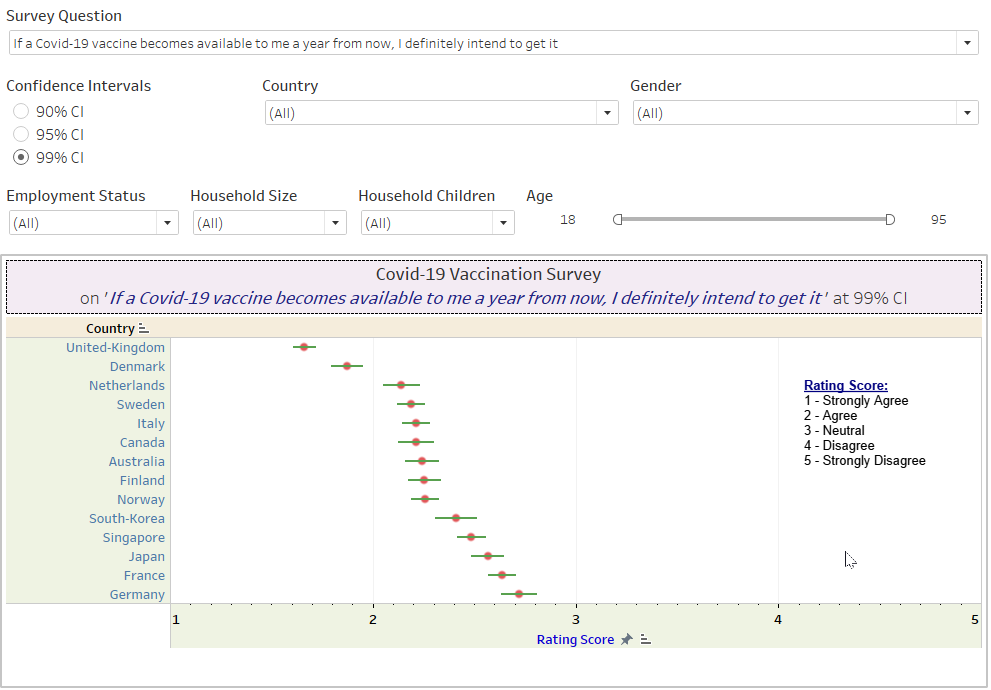

-   The screen above lacks the dashboard title. Let's edit the dashboard title as shown below.<br>
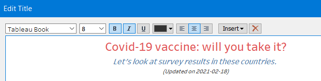

-   Right click the title and select the *Format Title...*.<br>


-   Format the title as shown below.<br>


-   Voila! Here is the final dashboard!

<br>

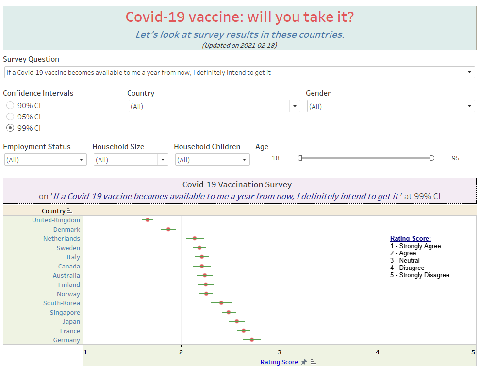


# 6. Final Data Visualization in Tableau 
Here is the final interactive data visualization in Tableau. You can visit my [Tableau Public Profile](https://public.tableau.com/profile/hngling#!/vizhome/Covid19_Survey_16137387399920/Covid-19VaccineSurvey) to play around.

<br>


# 7. Major Observations from my Data Viz

During the implementation progress, we can find out three major observations.

#### Observation 1
- By checking the gender discrepancy on the below two questions, we realize that **Female** are **more worried** than **Male** significantly in very country on getting the Covid19 virus and the potential side effects of the vaccine.
  -   Question: I am worried about getting COVID19.
  -   Question: I am worried about potential side effects of a COVID19 vaccine.


<br>


#### Observation 2
- By checking the countries on the below two questions, it is easily to observe that by and large **Group 1(Asian Countries: Japan, South Korea and Singapore)** are **more worried** than other countries (Group 2 except **France**) on getting Covid19 and then potential side effects of the vaccine.
  -   Question: I am worried about getting COVID19.
  -   Question: I am worried about potential side effects of a COVID19 vaccine.
  


<br>


#### Observation 3
- When it comes to the **zeal for vaccination**, the people in **United Kingdom** and **Denmark** had astonishingly **much higher** rating scores than other countries. They claimed that they will definitely take the vaccination.
  -   Question: If I do not get a COVID19 vaccine when it is available, I will regret it
  -   Question: If a Covid-19 vaccine becomes available to me a year from now, I definitely intend to get it.
  


<br>


